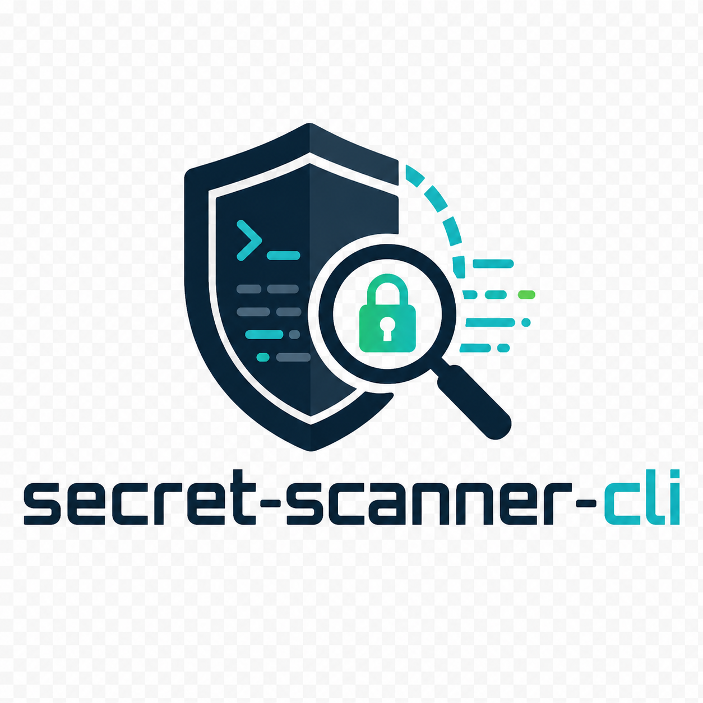

<div align="center">
  

  <h1>Secret Scanner CLI</h1>

  <p>Defensive Python CLI for authorized GitHub secret scanning.</p>

  <p>
    <a href="https://github.com/JuanCardesa/secret-scanner-cli/actions/workflows/ci.yml">
      
    </a>
  </p>
</div>

A Python CLI for scanning public GitHub repositories for exposed secrets using
regex pattern matching and Shannon entropy analysis.

> Status: Phases 1 and 2 are implemented. The detectors and GitHub API client
> are covered by unit tests. Scan orchestration and CLI commands are planned
> next.

## Features

- Regex-based detection from external `patterns.yaml` definitions.
- Shannon entropy detection for high-entropy token-like strings.
- Typed findings with dataclasses.
- Secret redaction before values leave the detector layer.
- Unit tests for detector behavior and common false-positive filters.
- Async GitHub REST API client with token auth, pagination, rate-limit backoff,
  and safe blob decoding.

## Planned CLI

```bash
secret-scanner scan repo owner/repo
secret-scanner scan org organization-name
```

Planned flags include `--branch`, `--exclude`, `--output json|html`, and
`--severity`.

## Development

```bash
python -m venv .venv
.venv\Scripts\activate
python -m pip install -e ".[dev]"
python -m pytest
```

## Configuration

The GitHub client reads `GITHUB_TOKEN` from the environment when available.
Copy `.env.example` to `.env` for local development and keep `.env` out of Git.
Use a token that belongs to you and only scan repositories you are authorized to
audit.

## Project Layout

```text
secret-scanner-cli/
|-- .github/
|   `-- workflows/
|       `-- ci.yml
|-- docs/
|   `-- assets/
|       `-- secret-scanner-cli-logo.png
|-- src/
|   `-- secret_scanner/
|       |-- detectors/
|       |-- github_client.py
|       |-- models.py
|       `-- patterns.yaml
|-- tests/
|-- .env.example
|-- LEGAL.md
|-- LICENSE
|-- README.md
`-- pyproject.toml
```

## Roadmap

- Repository and organization scanning orchestration.
- Click-based CLI.
- Terminal, JSON, and HTML reports.
- Severity filtering and path exclusion.

## Legal

Use this tool only on repositories you own or are explicitly authorized to test.
See [LEGAL.md](LEGAL.md).
